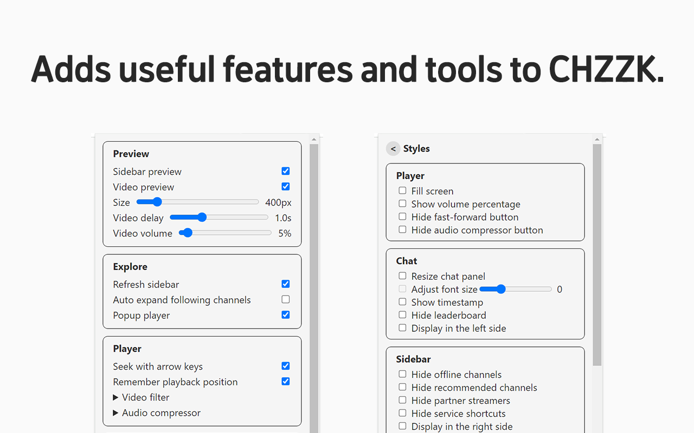

#  Cheese Knife

> CHZZK Toolkit

[Website](https://www.chz.app/) | [Discord](https://discord.gg/9kq3UNKAkz) | [Chrome Web Store (Chromium, Edge, Whale compatible)](https://chromewebstore.google.com/detail/nfkfgkkhgglkgnlppncolmpekidapkjh) | [Firefox Add-ons](https://addons.mozilla.org/addon/cheese-knife/) | [Korean](./README-en.md)

## Features

### Explore

- **Live Preview:** Preview live by hovering over the channel.
- **Refresh Sidebar:** Refresh the sidebar every 30 seconds.
- **Popup Player:** View multiple lives in one window.

### Player

- **Stats Menu:** Select Stats from the right-click menu to view resolution, bitrate, FPS, latency, and codec.
- **Seek with Arrow Keys:** Use the arrow keys to rewind a short amount of time.
- **Remember Playback Position:** Remember where you left in the VOD.
- **Video Filters:** Adjust video brightness, contrast, and gamma, and apply a sharpen filter.
- **Audio Compressor:** Reduce loud sounds to adjust the dynamic range to make the sound more comfortable.

### Chat

- **Hide Donation Messages:** Hide Cheese messages in the chat.
- Adjust chat panel and font size

It also adds many other useful features and allows to customize styles.

> This extension is not affiliated with CHZZK, and related trademarks are the property of their respective owners. You assume all responsibility for the consequences of using this extension.
