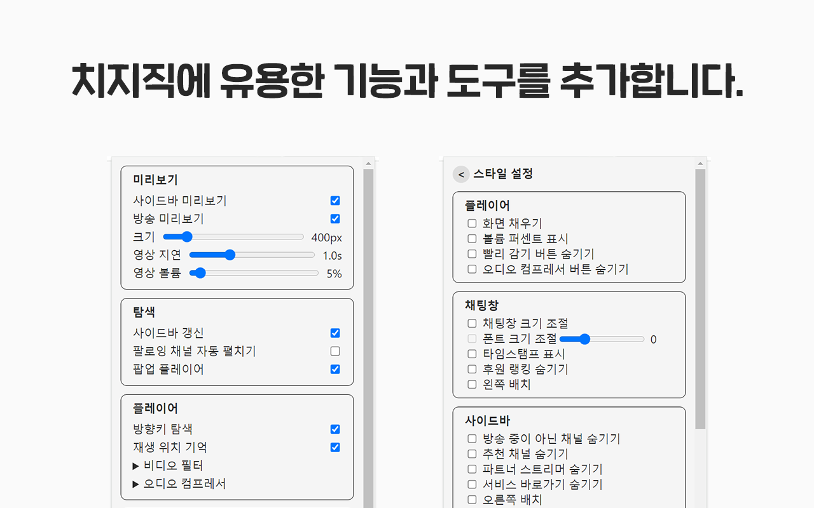

#  치즈 나이프

> 치지직 도구 모음

[Website](https://www.chz.app/) | [Discord](https://discord.gg/9kq3UNKAkz) | [Chrome Web Store (Chromium, Edge, Whale 호환)](https://chromewebstore.google.com/detail/nfkfgkkhgglkgnlppncolmpekidapkjh) | [Firefox Add-ons](https://addons.mozilla.org/addon/cheese-knife/) | [English](./README-en.md)

## 기능

### 탐색

- **방송 미리보기:** 마우스를 올리면 방송을 미리 볼 수 있습니다.
- **사이드바 갱신:** 30초마다 사이드바를 새로고침 합니다.
- **팝업 플레이어:** 여러 방송을 한 창에서 볼 수 있습니다.

### 플레이어

- **통계 메뉴:** 오른쪽 클릭 메뉴에서 통계를 선택하면 해상도, 비트레이트, FPS, 지연시간, 코덱을 확인할 수 있습니다.
- **방향키 탐색:** 방향키를 이용하여 짧은 시간을 되돌려 볼 수 있습니다.
- **재생 위치 기억:** 다시보기에서 마지막으로 본 위치를 기억합니다.
- **영상 필터:** 영상 밝기, 대비, 감마를 조정할 수 있으며, 선명(샤픈) 필터를 적용할 수 있습니다.
- **오디오 컴프레서:** 큰 소리를 줄여 다이내믹 레인지를 조절하여 소리를 듣기 편안하게 만듭니다.

### 채팅

- **후원 채팅 숨기기:** 채팅창에서 치즈 후원을 숨깁니다.
- **채팅창, 폰트 크기 조절:** 채팅창의 크기와 폰트 크기를 조절할 수 있습니다.

이외에도 여러 유용한 기능을 추가하며 다양한 스타일을 설정할 수 있습니다.

## TODO

- [ ] E2E tests
- [ ] TypeScript
- [ ] React/Vue
- [ ] Modularize
- [ ] Webpack/Vite

> 본 확장 프로그램은 치지직과 관련이 없으며, 관련 상표는 각 소유자의 자산입니다. 본 확장 프로그램을 사용하여 발생하는 결과에 대한 모든 책임은 사용자에게 있습니다.
