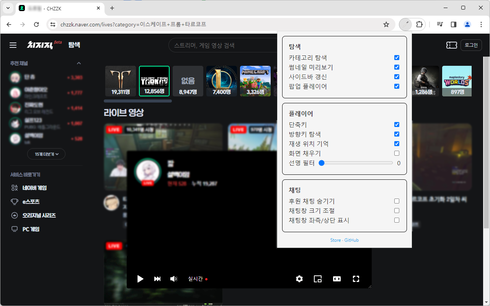
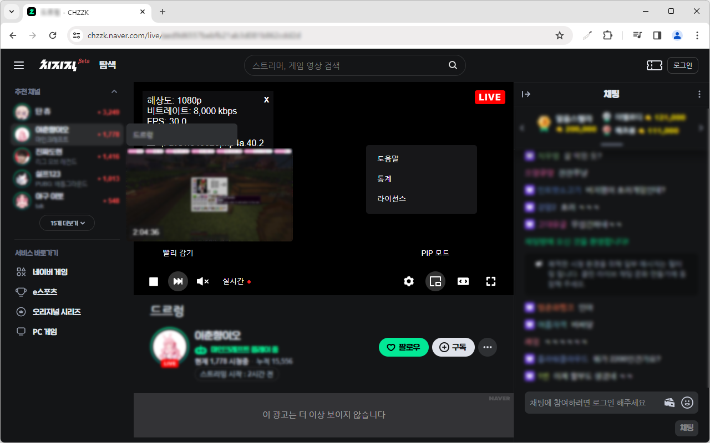
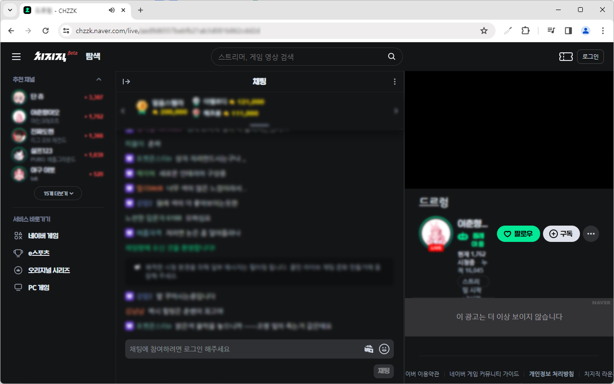

#  치즈 나이프

> 치지직 도구 모음

[Chrome Web Store (Chromium, Edge, Whale 호환)](https://chromewebstore.google.com/detail/nfkfgkkhgglkgnlppncolmpekidapkjh) | [Firefox Add-ons](https://addons.mozilla.org/addon/cheese-knife/)

## 기능

### 탐색

- **카테고리 탐색:** 전체 라이브 목록에서 카테고리별로 방송을 탐색할 수 있습니다.
- **썸네일 미리보기:** 마우스를 올리면 썸네일과 업타임을 미리 볼 수 있습니다.
- **사이드바 갱신:** 30초마다 사이드바를 새로고침 합니다.
- **팝업 플레이어:** 여러 방송을 한 창에서 볼 수 있습니다.

### 플레이어

- **빨리 감기 버튼:** 버퍼링으로 밀렸을 때 가장 최신 지점으로 이동할 수 있습니다.
- **PIP 모드 버튼:** Picture-in-Picture 모드로 전환합니다. (크롬 전용)
- **통계 메뉴:** 오른쪽 클릭 메뉴에서 통계를 선택하면 해상도, 비트레이트, FPS, 지연시간, 코덱을 확인할 수 있습니다.
- **단축키:** M - 음소거, T - 넓은 화면, F - 전체 화면
- **방향키 탐색:** 방향키를 이용하여 짧은 시간을 되돌려 볼 수 있습니다. (너무 뒤로 이동하면 영상 버퍼링이 중지될 수 있습니다. 이 경우에는 새로고침 해주시면 됩니다.)
- **재생 위치 기억:** 다시보기에서 마지막으로 본 위치를 기억합니다.
- **화면 채우기:** 좌우로 화면을 꽉 채워 필러박스를 제거합니다.
- **선명 필터:** 영상에 샤픈 필터를 적용합니다. 본 기능은 업스케일링(화질 개선)이 아닌 단순히 선명 효과를 적용하는 것이며, 하드웨어 가속이 켜져 있어야 합니다.

### 채팅

- **후원 채팅 숨기기:** 채팅창에서 치즈 후원을 숨깁니다.
- **채팅창 크기 조절:** 채팅창의 크기를 드래그로 조절할 수 있습니다.
- **좌측/상단 채팅창:** 채팅창을 영상 좌측 또는 상단에 표시합니다.

## TODO

- [ ] Rebase on [FrankerFaceZ](https://github.com/FrankerFaceZ/FrankerFaceZ)
- [ ] E2E tests
- [ ] TypeScript
- [ ] React
- [ ] Modularize
- [ ] Webpack/Vite

> 본 확장 프로그램은 치지직과 관련이 없으며, 관련 상표는 각 소유자의 자산입니다. 본 확장 프로그램을 사용하여 발생하는 결과에 대한 모든 책임은 사용자에게 있습니다.
